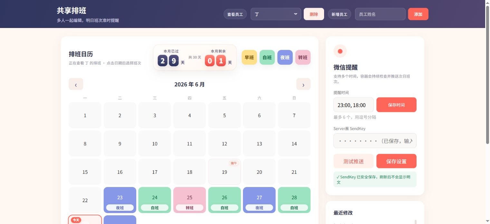
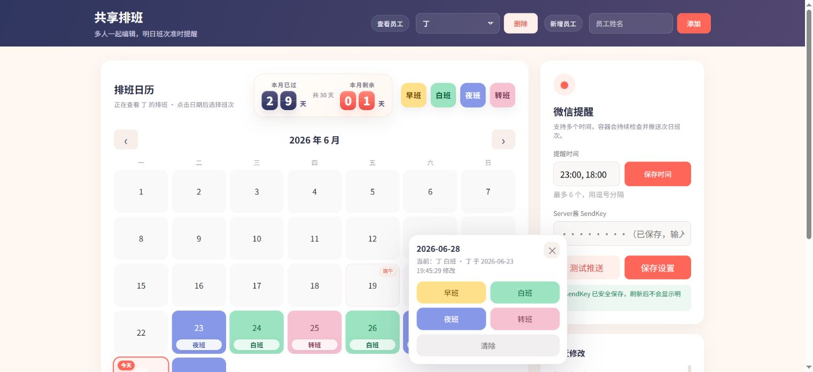
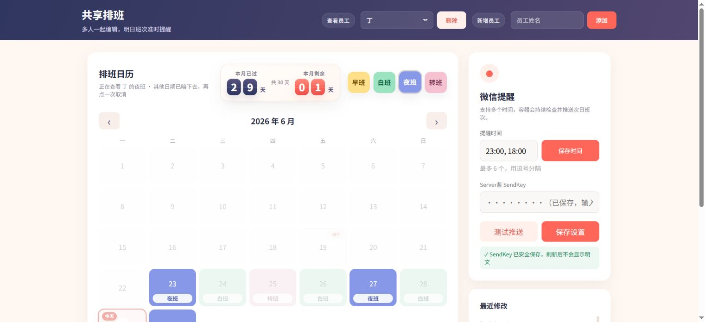

# 共享排班

一个适合小团队使用的网页排班工具，支持多人编辑、员工切换、颜色日历、班次统计、微信提醒和 Docker 部署。

## 功能

- 团队密码登录
- 多员工下拉切换，支持新增、删除员工
- 日历点击日期后弹出班次选择
- 支持早班、白班、夜班、转班
- 日期格内显示班次名称，颜色和文字一起识别
- 顶部班次颜色可点击筛选，其他班次会变暗
- 显示本月已过 / 本月剩余天数
- 显示本月统计、本月已上
- 自动显示中国大陆法定节假日
- 最近修改记录固定高度，内部滚动
- 支持多个微信提醒时间
- Server 酱微信推送次日班次
- SQLite 数据持久化

## 页面截图

### 主界面



### 班次选择



### 班次筛选



## 一键部署

如果已经安装 Docker 和 Docker Compose：

```bash
git clone https://github.com/dingqianyu/shift-reminder.git shift-reminder
cd shift-reminder
cp .env.example .env
```

编辑 `.env`，设置团队密码：

```bash
APP_PASSWORD=你的团队密码
```

启动：

```bash
docker compose up -d --build
```

访问：

```text
http://服务器IP:18080
```

## 使用 install.sh 部署

```bash
git clone https://github.com/dingqianyu/shift-reminder.git shift-reminder
cd shift-reminder
APP_PASSWORD=你的团队密码 bash install.sh
```

如果不传 `APP_PASSWORD`，脚本会使用 `change-me`，上线前请务必修改。

## 常用命令

查看容器：

```bash
docker ps | grep shift-reminder
```

查看日志：

```bash
docker logs -f shift-reminder
```

重启：

```bash
docker compose restart
```

更新代码后重新部署：

```bash
git pull
docker compose up -d --build
```

## 数据备份

所有数据保存在：

```text
./data/shifts.db
```

备份整个 `data` 文件夹即可。

## 配置

`.env` 示例：

```bash
APP_PASSWORD=请改成一个团队密码
```

`docker-compose.yml` 默认端口：

```yaml
ports:
  - "18080:8080"
```

如果想改外部访问端口，例如改成 `8088`：

```yaml
ports:
  - "8088:8080"
```
